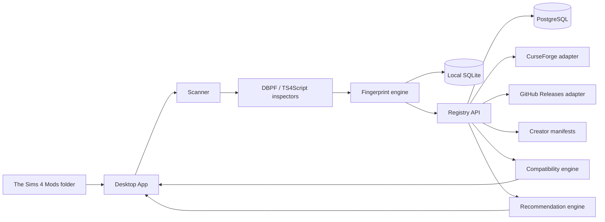

# Sims Mod Health

> Offline-first health manager for The Sims 4 mods and custom content.

Sims Mod Health is a Windows desktop application that inventories a local Mods folder, identifies installed mods and CC, explains what they do, checks known versions and compatibility, detects duplicates and likely conflicts, surfaces dependencies, and recommends compatible alternatives or related mods.

The product is designed around one boundary: **local files stay local**. Raw `.package` and `.ts4script` files are parsed on-device; the cloud registry receives only the minimum metadata needed for identification and health resolution.

## Product status

**Stage:** Windows Beta 1 candidate  
**AppFactory preset:** `desktop / windows / tauri-react`  
**Repository:** private by default  
**Project automation:** zero-PAT GitHub Actions OIDC broker

## Product principles

- **Offline-first:** scanning and local inventory work without an account.
- **Evidence before confidence:** `Unknown` is never silently converted to `Broken`.
- **Safe inspection:** script mods are inspected, never executed.
- **Explain, do not alarm:** conflicts are described as potential unless evidence proves incompatibility.
- **Recoverable changes:** any future update or disable action must support backup and rollback.
- **Source-respectful:** use official APIs, creator manifests and explicitly permitted sources; no prohibited scraping.

## Target architecture



The desktop app owns local files and diagnostics. The cloud owns the shared mod registry, source adapters, compatibility state and recommendations. See [Architecture](docs/ARCHITECTURE.md).

## Target UX

The application should feel like a **calm diagnostic utility**, not a game launcher: dense enough for power users, readable enough for someone who only remembers that `Random_Final_v2.package` “did something with relationships”.

Primary surfaces:

- Overview
- Library
- Updates
- Conflicts
- Diagnostics
- Discover
- Backups
- Settings

The detailed visual contract lives in [Design Target](docs/design/TARGET_UI.md).

## Delivery model

Planning is maintained as a PERT network with explicit dependencies and three-point estimates. The current reference path is documented in [PERT](docs/planning/PERT.md).

Work is not considered done because code exists. Each issue must satisfy the repository-wide [Proof of Done](docs/governance/PROOF_OF_DONE.md) and provide verifiable evidence in its PR.

## Security and privacy

The parser treats every mod file as untrusted input. It must enforce bounded reads, archive limits, path validation and non-execution of script contents. The threat model is maintained in [Threat Model](docs/security/THREAT_MODEL.md).

No raw mod file, save, household, screenshot or personal Sims data is uploaded by default.

## Development

Prerequisites:

- Node.js 24+
- Rust stable
- Windows WebView2 runtime

```bash
npm install
npm run tauri dev
```

Validation:

```bash
npm run build
cargo fmt --manifest-path src-tauri/Cargo.toml -- --check
cargo check --manifest-path src-tauri/Cargo.toml
```

## Documentation

- [Architecture](docs/ARCHITECTURE.md)
- [Architecture decisions](docs/adr/README.md)
- [Architecture baseline acceptance](docs/architecture/BASELINE_ACCEPTANCE.md)
- [Local SQLite database](docs/storage/LOCAL_DATABASE.md)
- [Windows Sims 4 discovery](docs/game-discovery/WINDOWS_DISCOVERY.md)
- [Read-only DBPF parser](docs/dbpf/READ_ONLY_PARSER.md)
- [Safe TS4Script archive inspector](docs/ts4script/SAFE_INSPECTOR.md)
- [Artifact fingerprints and exact duplicates](docs/fingerprints/ARTIFACT_IDENTITIES.md)
- [Incremental Mods scanner](docs/scanner/INCREMENTAL_SCANNER.md)
- [Design Target](docs/design/TARGET_UI.md)
- [PERT](docs/planning/PERT.md)
- [Proof of Done](docs/governance/PROOF_OF_DONE.md)
- [Threat Model](docs/security/THREAT_MODEL.md)
- [Source Policy](docs/governance/SOURCE_POLICY.md)
- [Windows Beta validation](docs/releases/WINDOWS_BETA_VALIDATION.md)
- [Beta 1 release notes](docs/releases/0.1.0-beta.1.md)

## Disclaimer

Sims Mod Health is an unofficial community tool. It is not affiliated with or endorsed by Electronic Arts, Maxis, CurseForge or any mod creator. Product names and trademarks belong to their respective owners.
