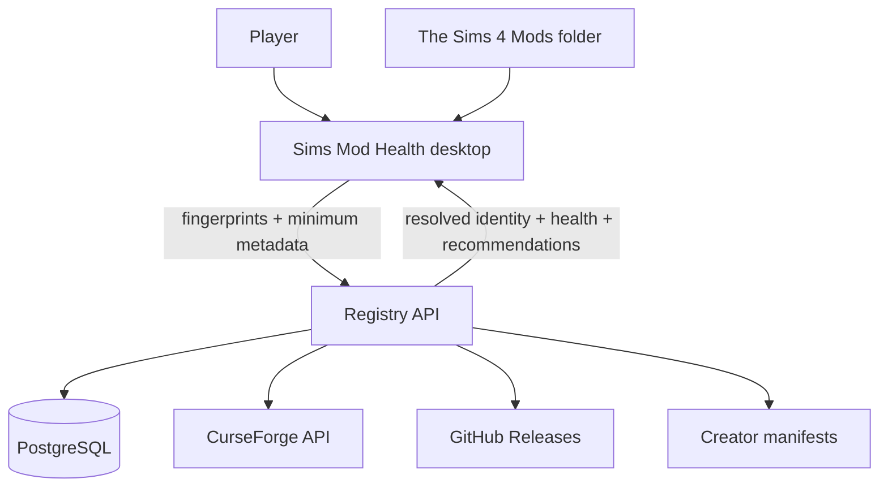

# Architecture

## 1. Purpose

Sims Mod Health is an offline-first desktop application backed by a shared registry service.

The architecture separates two trust domains:

1. **Local trust domain:** the player's filesystem, installed game version, Mods folder and diagnostics.
2. **Shared trust domain:** public mod metadata, release fingerprints, compatibility state, source adapters and recommendations.

Raw local mod files do not cross this boundary by default.

## 2. Context



## 3. Desktop boundary

**Technology:** Tauri 2, React, TypeScript and Rust.

The WebView is responsible for presentation and user interaction. Privileged operations stay behind narrow Rust commands.

Planned native modules:

- installation discovery
- game-version resolution
- recursive inventory
- incremental scan cache
- DBPF read-only parser
- TS4Script archive inspector
- SHA-256 and source-specific fingerprints
- duplicate and resource-key analysis (local exact duplicate + Potential conflict evidence)
- diagnostics parsing
- SQLite persistence
- backup and rollback

The frontend must not receive unrestricted filesystem permissions.

## 4. Cloud boundary

**Target stack:** FastAPI, PostgreSQL, SQLAlchemy, Alembic and Pydantic.

Redis and background workers are deferred until ingestion volume requires scheduled polling or heavier asynchronous processing.

Primary responsibilities:

- mod and creator registry
- releases and artifacts
- patch compatibility state
- dependencies and known incompatibilities
- source adapters
- recommendation taxonomy
- community reports with provenance
- batch resolution API

## 5. Logical repository structure

```text
sims-mod-health/
├── src/                       React UI
├── src-tauri/                 Tauri shell and native command boundary
├── crates/
│   ├── dbpf/                  read-only package parsing
│   ├── fingerprint/           hashes and artifact identity
│   ├── scanner/               filesystem inventory and cache
│   └── diagnostics/           exception/report parsing
├── services/
│   └── registry-api/          FastAPI service
├── packages/
│   ├── api-contracts/         generated/shared API contracts
│   └── taxonomy/              categories and feature ontology
└── docs/
```

The generated AppFactory scaffold starts with the desktop shell at repository root. Additional modules are introduced only when their corresponding issues start; empty architecture cosplay is avoided.

## 6. Local data model

SQLite is expected to own:

- installations
- scan sessions
- local files
- local artifacts
- local mods
- hashes/fingerprints
- conflict observations
- diagnostics
- restore points
- preferences

Incremental scans should avoid re-hashing unchanged files using path, size and modification time as a cache key, while preserving a way to force a full verification scan.

## 7. Registry domain model

Core entities:

- Creator
- Mod
- ModRelease
- Artifact
- Fingerprint
- Source
- GamePatch
- CompatibilityReport
- Dependency
- ConflictRule
- Category
- Feature
- Alternative
- UserReport

A compatibility statement must include provenance and scope. A status without evidence is not authoritative.

Dependency and known-incompatibility rules also retain provenance. File-level DBPF overlap stays in the local trust domain; the registry receives resolved release IDs rather than local resource keys.

## 8. Resolution pipeline


Only deterministic matches may be treated as exact. Probabilistic matches are shown with confidence and require a distinct UI state.

## 9. Health states

The product uses a small explicit state machine:

- Compatible
- Update available
- Compatibility unknown
- Potential conflict
- Broken
- Abandoned

`Unknown` is not equivalent to `Broken`.

When a new Sims patch is released, compatibility inherited from earlier patches may expire to `Unknown` until a trusted source confirms the mod or a compatible release is resolved.

## 10. Update safety

Automatic update is not part of the first scanner MVP.

When introduced, the operation must be transactional:

1. create restore point;
2. download from an allowlisted source;
3. verify expected fingerprint/hash where available;
4. stage the replacement;
5. disable or archive the old release;
6. install the new release;
7. validate resulting layout;
8. allow one-click rollback.

## 11. Performance strategy

- stream directory enumeration;
- cache hashes;
- parse only resource metadata required by current features;
- bound archive and resource reads;
- batch registry resolution;
- keep UI work off the scanner thread;
- expose scan progress and cancellation.

## 12. Observability

Target instrumentation:

- desktop crash reporting with user consent;
- backend structured logs;
- API latency;
- scanner failure categories;
- registry freshness;
- unresolved artifact rate;
- match-confidence distribution.

The most important product metric is the percentage of installed artifacts identified with high confidence.

## 13. Architecture decisions

The initial decision set is encoded directly in this document and the threat model:

- offline-first local authority;
- Tauri/Rust privileged boundary;
- deterministic health state as source of truth;
- source adapters rather than generalized scraping;
- modular monolith backend before microservices.

These decisions should become ADRs if they need independent revision history.
