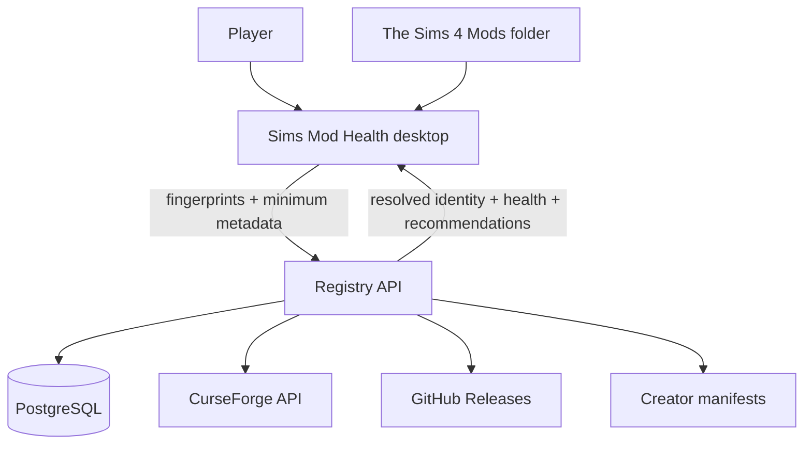

# Architecture

## 1. Purpose

Sims Mod Health is an offline-first desktop application backed by a shared registry service.

The architecture separates two trust domains:

1. **Local trust domain:** the player's filesystem, installed game build, locally present content packs, Mods folder and diagnostics.
2. **Shared trust domain:** public mod metadata, public game/pack compatibility metadata, release fingerprints, compatibility state, source adapters and recommendations.

Raw local mod files and game/content-pack payloads do not cross this boundary by default. Local pack presence is not treated as proof of ownership or entitlement.

## 2. Context



## 3. Desktop boundary

**Technology:** Tauri 2, React, TypeScript and Rust.

The WebView is responsible for presentation and user interaction. Privileged operations stay behind narrow Rust commands.

Planned native modules:

- user-data and game-installation discovery
- game-version resolution
- installed content-pack inventory
- provider capability detection
- recursive mod inventory
- incremental scan cache
- DBPF read-only parser
- TS4Script archive inspector
- SHA-256 and source-specific fingerprints
- duplicate and resource-key analysis (local exact duplicate + Potential conflict evidence)
- diagnostics parsing
- SQLite persistence
- backup and rollback

The frontend must not receive unrestricted filesystem permissions.

## 4. Cloud boundary

**Target stack:** FastAPI, PostgreSQL, SQLAlchemy, Alembic and Pydantic.

Redis and background workers are deferred until ingestion volume requires scheduled polling or heavier asynchronous processing.

Primary responsibilities:

- mod and creator registry
- releases and artifacts
- patch compatibility state
- dependencies and known incompatibilities
- source adapters
- recommendation taxonomy
- community reports with provenance
- batch resolution API

## 5. Logical repository structure

```text
sims-mod-health/
├── src/                       React UI
├── src-tauri/                 Tauri shell and native command boundary
├── crates/
│   ├── dbpf/                  read-only package parsing
│   ├── fingerprint/           hashes and artifact identity
│   ├── scanner/               filesystem inventory and cache
│   └── diagnostics/           exception/report parsing
├── services/
│   └── registry-api/          FastAPI service
├── packages/
│   ├── api-contracts/         generated/shared API contracts
│   └── taxonomy/              categories and feature ontology
└── docs/
```

The generated AppFactory scaffold starts with the desktop shell at repository root. Additional modules are introduced only when their corresponding issues start; empty architecture cosplay is avoided.

## 6. Local data model

SQLite is expected to own:

- installations
- game build observations
- installed pack observations
- provider/update workflow state
- scan sessions
- local files
- local artifacts
- local mods
- hashes/fingerprints
- conflict observations
- diagnostics
- restore points
- preferences

Incremental scans should avoid re-hashing unchanged files using path, size and modification time as a cache key, while preserving a way to force a full verification scan.

## 7. Registry domain model

Core entities:

- Creator
- Mod
- ModRelease
- Artifact
- Fingerprint
- Source
- GamePatch
- ContentPack
- PackCompatibility
- CompatibilityReport
- Dependency
- ConflictRule
- Category
- Feature
- Alternative
- UserReport

A compatibility statement must include provenance and scope. A status without evidence is not authoritative.

Dependency and known-incompatibility rules also retain provenance. File-level DBPF overlap stays in the local trust domain; the registry receives resolved release IDs rather than local resource keys.

## 8. Resolution pipeline


Only deterministic matches may be treated as exact. Probabilistic matches are shown with confidence and require a distinct UI state.

## 9. Health states

The product uses a small explicit state machine:

- Compatible
- Update available
- Compatibility unknown
- Potential conflict
- Broken
- Abandoned

`Unknown` is not equivalent to `Broken`.

When a new Sims patch is released, compatibility inherited from earlier patches may expire to `Unknown` until a trusted source confirms the mod or a compatible release is resolved.

## 10. Game and DLC health boundary

Game and DLC support follows ADR-0005 and extends the health model rather than creating a separate updater product.

The native core exposes narrow ports:

- `GameVersionProbe`;
- `PackInventoryProbe`;
- `ContentManifestSource`;
- `PlatformUpdateAdapter`;
- `ContentHealthRepository`.

Provider-specific behavior uses Strategy adapters. External manifest/provider schemas cross an Anti-Corruption Layer before entering the domain. Update progress is an explicit state machine:

```text
Detected -> ActionRequired -> ProviderOpened -> AwaitingRescan
         -> Verified | StillOutdated | Unknown | Failed
```

The default Game/DLC update action is an official-provider handoff. Sims Mod Health does not infer entitlement from local pack folders and does not include entitlement unlockers.

Provider handoff is implemented as a Strategy behind the Rust privilege boundary. The WebView does not receive generic shell/process capability. Provider sessions are journaled in SQLite and remain `awaiting_rescan` across restart until a local inventory refresh verifies the result. Verification also triggers an incremental Mods scan and reruns Registry-backed Mod health against the newly observed program build.

After a provider update, local game/pack state is rescanned and the mod compatibility engine is reevaluated against the newly observed patch.

Direct binary patching is not part of this baseline. Any future delta engine is gated on independently verified payload rights, provenance and integrity.

Game/DLC compatibility metadata crosses a Registry anti-corruption boundary through `GET /v1/game-content/manifest`. The desktop caches the latest validated normalized manifest for offline use and marks cached results stale rather than silently treating them as current. Conflicting local/manifest evidence produces a disputed Unknown state.

## 11. Update safety

Single-artifact automatic update is implemented behind a narrow Rust/Tauri mutation boundary.

The operation is transactional:

1. create and verify a restore point;
2. download from a source-adapter-specific HTTPS allowlist;
3. verify expected SHA-256 where available and always record observed SHA-256;
4. stage the replacement under app-controlled storage;
5. evaluate the current and hypothetical replacement dependency graph;
6. archive the old release only after the dependency check passes;
7. install through a same-directory temporary file;
8. validate path containment, file type and SHA-256;
9. retain a persistent journal and restore point for rollback.

Startup marks unfinished transactions as interrupted instead of assuming success. Rollback verifies the backup before restoring it.

Bulk update remains disabled. See `docs/security/STAGED_UPDATE_ROLLBACK.md`.

## 12. Performance strategy

- stream directory enumeration;
- cache hashes;
- parse only resource metadata required by current features;
- bound archive and resource reads;
- batch registry resolution;
- keep UI work off the scanner thread;
- expose scan progress and cancellation.

## 13. Observability

Target instrumentation:

- desktop crash reporting with user consent;
- backend structured logs;
- API latency;
- scanner failure categories;
- registry freshness;
- unresolved artifact rate;
- match-confidence distribution.

The most important product metric is the percentage of installed artifacts identified with high confidence.

## 14. Architecture decisions

The initial decision set is encoded directly in this document and the threat model:

- offline-first local authority;
- Tauri/Rust privileged boundary;
- deterministic health state as source of truth;
- source adapters rather than generalized scraping;
- unified Game/DLC/Mod health rather than separate launcher-style products;
- provider handoff before direct Game/DLC patching;
- modular monolith backend before microservices.

These decisions should become ADRs if they need independent revision history.
