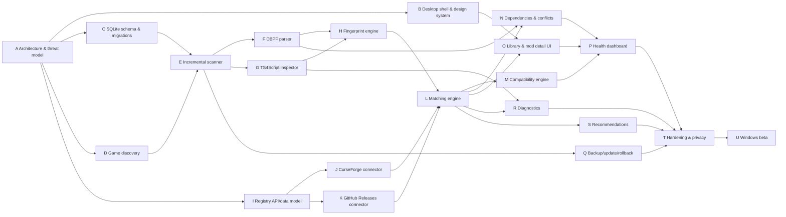

# PERT Plan

## Method

This plan uses three-point PERT estimates:

```text
Expected time (TE) = (Optimistic + 4 × Most likely + Pessimistic) / 6
```

Values are working days of focused engineering effort, not calendar commitments. Parallel work can reduce elapsed calendar time; integration, reviews and external-source uncertainty can increase it.

## Network



## Estimates

| ID | Work package | Depends on | O | M | P | TE |
|---|---|---|---:|---:|---:|---:|
| A | Architecture & threat model | — | 1 | 2 | 4 | 2.17 |
| B | Desktop shell & design system | A | 2 | 3 | 5 | 3.17 |
| C | Local SQLite schema & migrations | A | 1 | 2 | 3 | 2.00 |
| D | Game install/version discovery | A | 1 | 2 | 3 | 2.00 |
| E | Incremental file scanner | C, D | 3 | 4 | 6 | 4.17 |
| F | DBPF read-only parser | E | 4 | 6 | 10 | 6.33 |
| G | TS4Script safe inspector | E | 2 | 4 | 6 | 4.00 |
| H | Fingerprint engine | F, G | 2 | 3 | 5 | 3.17 |
| I | Registry API/data model | A | 3 | 5 | 8 | 5.17 |
| J | CurseForge connector | I | 2 | 4 | 7 | 4.17 |
| K | GitHub Releases connector | I | 2 | 3 | 5 | 3.17 |
| L | Artifact/mod matching engine | H, J, K | 3 | 5 | 8 | 5.17 |
| M | Compatibility engine | L | 3 | 5 | 8 | 5.17 |
| N | Dependency/conflict engine | F, L | 3 | 5 | 9 | 5.33 |
| O | Library & mod detail UI | B, L | 3 | 5 | 8 | 5.17 |
| P | Health dashboard | M, N, O | 2 | 3 | 5 | 3.17 |
| Q | Backup/update/rollback planner | E | 3 | 5 | 8 | 5.17 |
| R | Diagnostics parser | G, L | 3 | 5 | 8 | 5.17 |
| S | Recommendation engine | L | 2 | 4 | 7 | 4.17 |
| T | Hardening & privacy validation | P, Q, R, S | 3 | 5 | 9 | 5.33 |
| U | Windows beta packaging | T | 2 | 3 | 5 | 3.17 |

## Reference critical path

With the current estimates, the reference critical path is:

```text
A → C → E → F → H → L → N → P → T → U
```

Expected focused effort along that path is approximately **40 working days**.

This is a planning signal, not a delivery promise. The path should be recalculated when an issue materially changes estimate, dependency or scope.

## Milestone exits

**Foundation**
- architecture and threat model accepted
- design target committed
- SQLite and game-discovery contracts defined

**Scanner**
- local inventory, DBPF/TS4Script inspection and fingerprints work on fixtures
- incremental scan behavior proven

**Registry**
- source adapters and matching resolve known fixtures with provenance

**Health Engine**
- compatibility, dependencies and conflicts expose deterministic evidence

**Discovery**
- explainable recommendations pass compatibility filtering

**Hardening**
- parser limits, privacy behavior, backups and diagnostics are validated

**Beta**
- signed/reproducible Windows artifact strategy documented
- release checklist and rollback path proven
