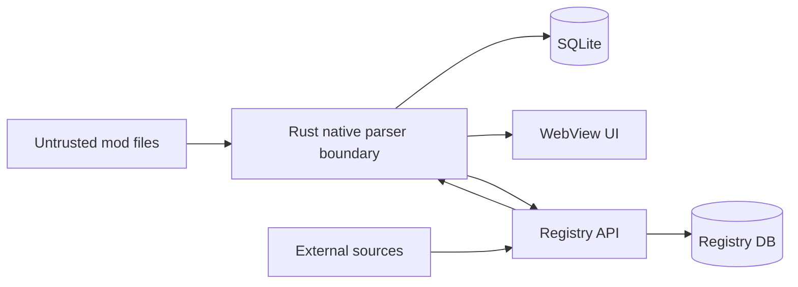

# Threat Model

## Scope

Sims Mod Health parses third-party files, inspects archives and may later download updates. The application must assume mod content is untrusted even when the creator is reputable.

## Assets

Protect:

- the user's filesystem
- saves and game installation
- local Sims data
- authentication credentials
- registry integrity
- update/rollback state
- creator/source identity
- the user's privacy

## Trust boundaries

The WebView does not receive unrestricted filesystem access.

## Primary threats and controls

### Malformed DBPF

Threat: crafted resource tables, huge counts, invalid offsets, integer overflow or excessive allocation.

Controls:
- validate offsets against file size;
- checked integer arithmetic;
- cap resource count and individual read size;
- stream where practical;
- reject malformed structures cleanly;
- maintain adversarial fixtures and fuzz targets.

Current DBPF parser limits:
- at most 1,000,000 declared resource entries;
- at most 128 MiB declared index bytes;
- fixed 96-byte header read;
- scalar 2/4-byte index reads only;
- zero resource-payload bytes read during metadata parsing;
- unknown index-layout flag bits are rejected rather than guessed.

### TS4Script execution

Threat: executing bundled Python or native payload while trying to inspect it.

Controls:
- treat `.ts4script` as data/archive only;
- never import or execute embedded modules;
- inspect names/metadata with bounded reads;
- do not shell out to Python to load the mod.

Current TS4Script inspector limits:
- physical archive: 256 MiB;
- archive entries: 4,096;
- single expanded entry: 64 MiB;
- total declared expanded bytes: 512 MiB;
- maximum compression ratio: 500:1;
- path depth: 32 components;
- entry-name length: 1,024 bytes;
- individual metadata read: 64 KiB;
- total metadata reads: 256 KiB;
- nested archives are never recursively opened.

### Archive bombs

Threat: extreme expansion ratio or deeply nested archive content.

Controls:
- maximum archive entries;
- maximum total expanded metadata budget;
- nesting limits;
- cancellation;
- no automatic extraction into user-controlled paths.

### Path traversal

Threat: archive member or update package writes outside a staging directory.

Controls:
- normalize and validate every destination;
- reject parent traversal and absolute paths;
- stage before install;
- prefer Rust-native file operations.

### Untrusted downloads

Threat: compromised mirror or malicious replacement.

Controls:
- allowlisted source adapters;
- HTTPS;
- source provenance;
- expected hash/fingerprint verification when available;
- download size limits;
- staged install;
- backup before mutation.

### Registry poisoning

Threat: false compatibility, creator or release data.

Controls:
- provenance per statement;
- source trust levels;
- immutable evidence history where feasible;
- distinguish creator/API facts from community reports;
- conflict resolution rules;
- audit trail for moderator changes.

### False-positive conflict claims

Threat: overlapping resource keys are presented as guaranteed breakage.

Controls:
- state model uses `Potential conflict`;
- deterministic `Broken` requires stronger evidence;
- expose why a conflict was flagged.

### Privacy leakage

Threat: sending filenames, saves, usernames, local paths or mod content unnecessarily.

Controls:
- raw files stay local by default;
- API requests prefer hashes/fingerprints and normalized technical metadata;
- redact local absolute paths from telemetry;
- diagnostics upload is opt-in and previewable;
- no saves/households/screenshots are collected for registry resolution.

### Excessive Tauri permissions

Threat: compromised WebView gains broad filesystem access.

Controls:
- default capability remains minimal;
- privileged work happens in narrow Rust commands;
- every new capability requires threat-model review and Proof of Done evidence.

## Non-goals

The first releases do not attempt to:

- execute mods safely in a sandbox;
- prove that arbitrary gameplay behavior is semantically correct;
- crack, decompile or bypass paid mod access;
- download from sources that prohibit automated retrieval.

## Security reporting

Do not file sensitive vulnerability details in a public issue. Until a dedicated private disclosure channel exists, report security findings directly to the repository owners through the organization's private communication channel.
